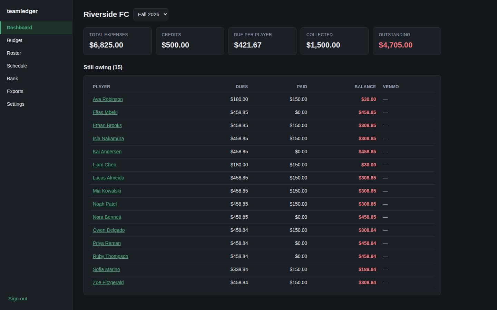
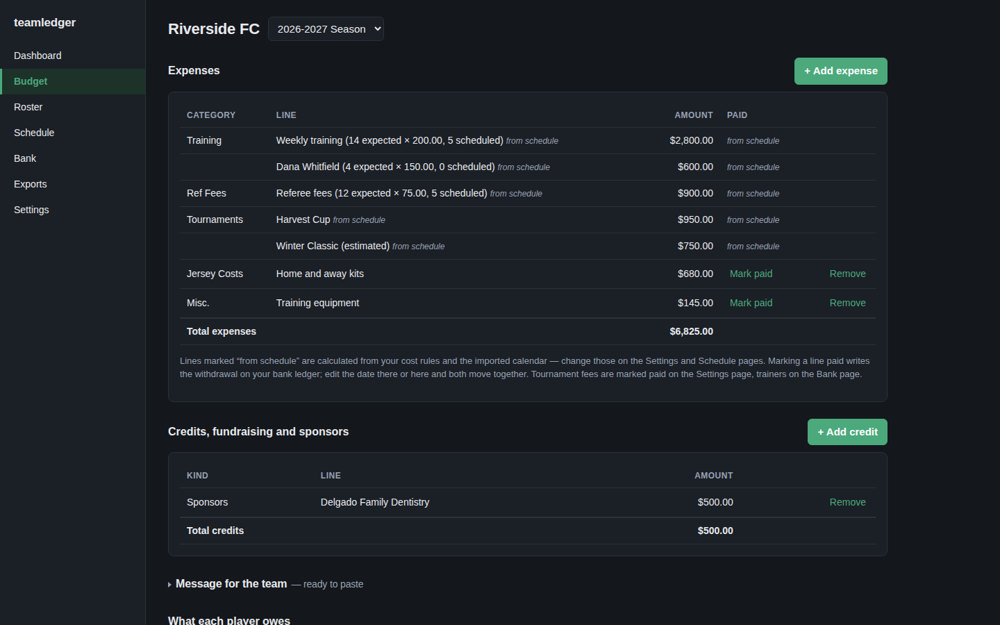
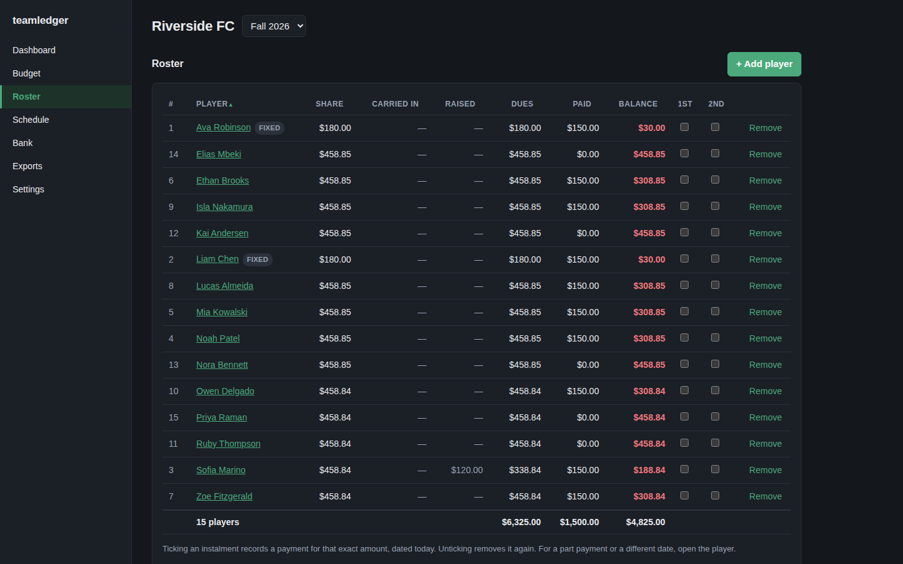
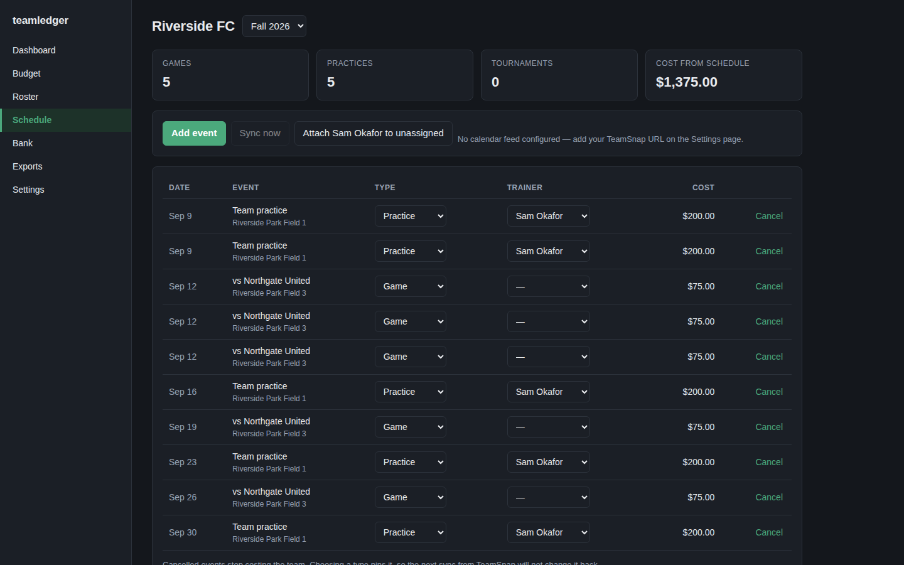
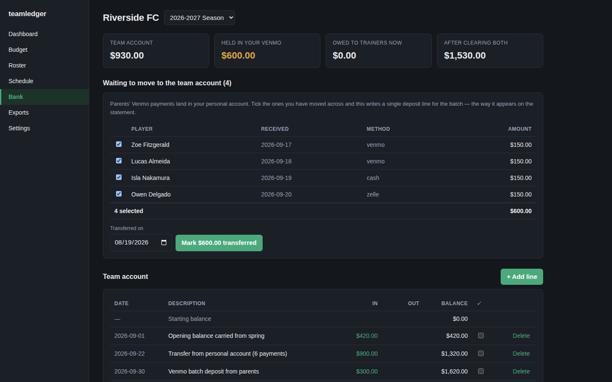
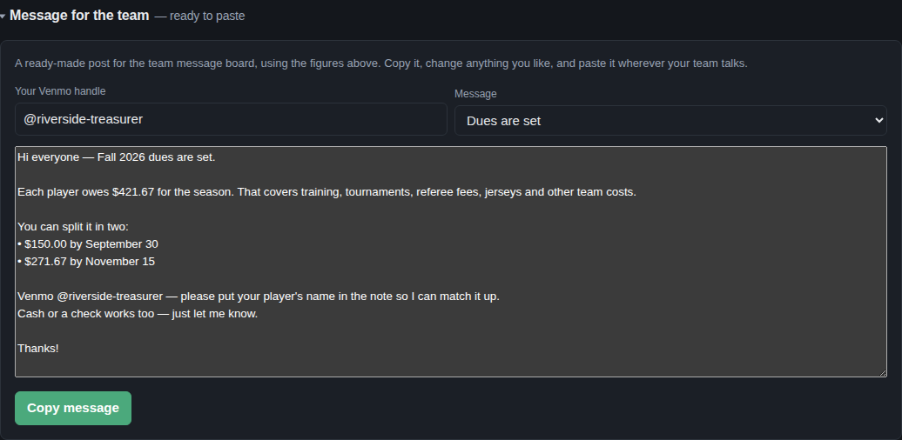
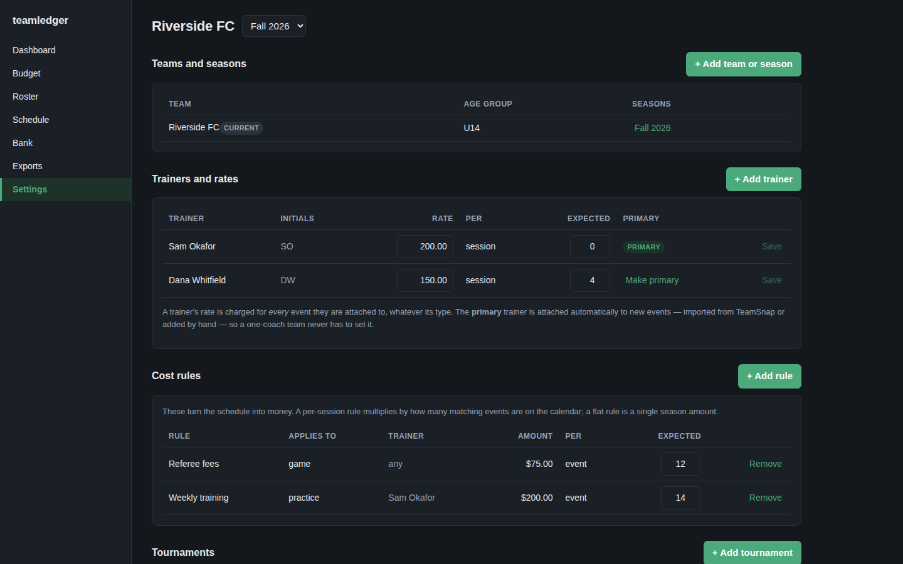

# teamledger

Self-hosted treasury for a youth sports team. It replaces the spreadsheet most
team treasurers end up maintaining: what the season costs, what each player owes,
who has paid, what's actually in the team bank account, and what carries over
when the season ends.

The thing it does that a spreadsheet cannot: it reads your **schedule** and
prices it. Point it at any iCal feed — TeamSnap, SportsEngine, Spond, a club's
ICS export, even a plain Google Calendar. Set "ref fee is $75 a game" and "Sam
charges $200 a session", and the ref-fee and training totals come from how many
games and practices are actually on the schedule — including when one gets
cancelled.

Ships with an empty database. Your data stays on your machine.



<sub>Every screenshot on this page is invented data. Note the balances —
$674.24 next to $674.23. Dues rarely divide evenly, so the shares are computed
to sum to the team total exactly rather than rounding each one up.</sub>

<details>
<summary><b>More screenshots</b> — budget, roster, schedule, bank, settings</summary>

**Budget** — expenses by category, offset by credits and fundraising. The ref-fee
and training lines are priced from the calendar, not typed in.



**Roster** — dues, instalments and what each player has paid.



**Schedule** — imported from your calendar feed. Each game and practice carries the cost it
generates.



**Bank** — the real account, plus the money still sitting in your personal Venmo.



**Message for the team** — the Budget page drafts the post for your team board,
with the real figures and dates already in it.



**Settings** — teams and seasons, trainers, cost rules, tournaments, and the
calendar feed.



Light mode versions are alongside these in [`docs/screenshots/`](docs/screenshots).

</details>

## Quick start

Requires Docker and Docker Compose. Save
[`docker-compose.yml`](docker-compose.yml) somewhere and run:

```sh
docker compose up -d
```

Open <http://localhost:3212>. The first screen creates your treasurer account.
There is no second account and no signup — this is a single-admin app.

That is the whole install: one container, one file, no checkout, no build step,
no `.env`, and no database password to invent. Everything is optional and has a
working default, including the session secret, which is generated on first boot
and stored in the database.

Whoever opens that first screen claims the instance, so do it before putting
teamledger anywhere the public can reach.

Released versions are published to GHCR and Docker Hub for `amd64` and `arm64`
(so a Pi or a NAS is fine). Pin as tightly as you like — `:0.8.0`, `:0.8`, `:0`
and `:latest` all exist. To build from source instead, clone the repo and
replace `image:` with `build: .`.

## Upgrading

```sh
docker compose pull && docker compose up -d
```

Migrations run automatically on every start and are idempotent, so there is no
separate upgrade step. Nothing is destructive; new columns are added, existing
data is left alone. If the database is *newer* than the image — you rolled back
— the app refuses to start rather than write into a schema it does not
understand.

### Upgrading from the Postgres version (0.7 and earlier)

Versions up to 0.7 ran two containers and kept data in Postgres. 0.8 embeds the
database in the app container. Your data is not stranded, but the move is
manual and one-time.

With the old stack still running:

```sh
# 1. Dump the old database to JSON (read-only; safe on a live instance)
./scripts/export-postgres.sh > pg-export.json

# 2. Stop the old stack
docker compose down
```

Then switch to the new `docker-compose.yml`, start it once so it creates an
empty database, and import:

```sh
docker compose up -d
docker compose stop app                     # import into a database nobody is writing to
cp pg-export.json data/
docker compose run --rm app node scripts/import-postgres.cjs /app/data/pg-export.json
docker compose start app
```

The importer refuses to run into a database that already has rows, so it cannot
half-merge into a live install. It preserves row IDs and your treasurer login.

**Check the season budget totals against what the old app showed before you
delete `db/data/`.** They should match to the cent.

## Data & backups

Everything is in one directory:

```
data/
├── teamledger.db          the database — the whole ledger
├── teamledger.db-wal      (SQLite working files)
├── receipts/              payment receipt uploads
└── backups/               nightly snapshots, last 14 kept
```

**To back up teamledger, copy the `data/` folder.** To move it to another
machine, copy `data/` next to a `docker-compose.yml` and run
`docker compose up -d`. That's the whole procedure — no dump, no restore, no
matching database versions on the far end.

The app also takes its own snapshot every night at 03:00 into `data/backups/`,
keeping the most recent 14. Those are ordinary SQLite files: to restore one,
stop the app, copy it over `data/teamledger.db`, and start it again. Set
`BACKUPS=off` to disable.

Copying `data/` while the app is running is safe enough for a home setup, but a
snapshot from `data/backups/` is taken atomically and is the better thing to
archive.

You can also export from inside the app at any time — CSVs of the roster,
payment ledger, budget and balances, plus the bank ledger. That's the format to
hand to next season's treasurer.

## Features

**Budget**
- Expense categories (training, ref fees, tournaments, jerseys, misc), offset by
  credits, fundraising and sponsors, divided across the roster.
- **Estimates**: say you expect 12 practices before the schedule exists and dues
  can be set in pre-season. The engine bills whichever is higher, your estimate
  or the number actually scheduled, so it never under-collects.
- **Two halves that each pay for themselves.** Set the date the spring starts
  and a year-long season splits in two: games, dated costs and instalments sort
  themselves into fall or spring, expected counts are entered per half, and the
  budget shows what each half costs against what its own payments raise. An
  annual total can look healthy while the autumn is quietly funded by money that
  does not arrive until March; this is the table that catches it.
- **Tournaments** with name, dates and registration fee, including ones you have
  not booked yet.

**Money in**
- **Messages for the team board.** The Budget page drafts the post — dues, the
  instalment dates, your Venmo handle — in four flavours: dues announced, a
  first-payment reminder, a final-payment nudge a week out, and a gentle chase
  for stragglers. Editable before you copy it.
- A payment ledger — every payment is a dated row with a method and a note, not a
  Yes/No checkbox, so the books survive a handover.
- **A payment plan of any length** — two instalments, or four across the year.
  Amounts left blank take an even share, so pinning a deposit re-splits the
  rest; every player gets their own figures, so an override or a carried
  balance still comes out right. Tick them off from the roster.
- **Per-player fundraising**: what a player raised themselves comes off their own
  bill, not the whole team's.
- Per-player dues overrides for scholarships, sibling discounts or late joiners.

**Money out**
- **Bank ledger** with a starting balance, running balance, and a reconcile tick
  for matching against your statement.
- **Venmo transfer tracking**: parents' payments land in *your* personal account
  first. Mark them transferred and it writes one deposit line for the batch.
- **Trainer payables**: what each trainer has earned for sessions that have
  already happened, minus what you have paid them. Future sessions never show as
  owed.
- Mark an expense or tournament fee paid and the withdrawal is written for you.

**Schedule**
- Subscribe to any iCal feed — TeamSnap, SportsEngine, Spond, a club ICS export,
  a shared Google Calendar; games and practices import and drive the
  derived costs.
- **Repeating events are expanded**, so a weekly practice published as a single
  recurring entry becomes twelve billable sessions rather than one. Individually
  skipped weeks (`EXDATE`) and moved weeks (`RECURRENCE-ID`) are honoured.
- Events the feed stops publishing are cancelled so they stop costing — but only
  future ones, since a feed that drops past events as they age out must not erase
  costs the team actually incurred.
- Add events by hand, with a weekly repeat.
- A primary trainer is attached to new events automatically.

**Everything else**
- **Name a season** whatever you call it — "2026-2027 Season" instead of
  "Fall 2026" — and it follows through to exports and parent statements.
- **Season rollover** — close a season and open the next with the same roster.
  Overpayments follow the player as a credit; leftover team funds arrive as a
  credit line.
- **More than one team** on the same instance, if you are treasurer twice over.
  Add them under Settings → Teams and seasons; each team keeps its own roster,
  trainers, bank account and books, and the season picker groups by team so two
  teams both having a "Fall 2026" is never ambiguous.
- Exports: CSV (roster, ledger, budget, balances, bank ledger) and PDF (budget
  sheet, detailed budget report, per-player statement).
- Works on a phone, and installs to the home screen as a standalone app.

## Configuration

**Every one of these is optional.** teamledger runs with no configuration at
all; set these in the compose file's `environment:` block, or in a `.env`, only
when you want to change a default. See `.env.example` for the annotated list.

| Variable | Notes |
|---|---|
| `SESSION_SECRET` | Generated on first boot and stored in the database. Set it only if you would rather manage it yourself. |
| `DATA_DIR` | Where the database, backups and receipts live. Default `/app/data`. |
| `BACKUPS` | `off` disables the nightly snapshot. |
| `APP_URL` | The URL you actually browse to. |
| `SECURE_COOKIES` | Default **off**. Turn on only when TLS is in front. Deliberately not tied to `NODE_ENV` — see below. |
| `TRUST_PROXY` | Default **off**. Turn on only when a proxy you control sets `X-Forwarded-For`. |
| `LOGIN_RATE_MAX` / `LOGIN_RATE_WINDOW_MS` | Failed logins allowed per window. Defaults: 10 per 15 minutes. |
| `NODE_ENV` | `production` in normal use. Does **not** affect cookie or proxy behaviour. |
| `TZ` | Your team's timezone, or the schedule drifts a day around midnight. |
| `ICAL_SYNC_INTERVAL_MINUTES` | Default 360. `0` disables the background sync. |
| `BUILD_ID` | Free-text label echoed by `/api/health`. |

### Running behind a reverse proxy

Terminate TLS at your proxy, forward to port 3212, and set:

```
APP_URL=https://teamledger.example.com
SECURE_COOKIES=true
TRUST_PROXY=true
```

Both switches default to **off**, and neither is inferred from `NODE_ENV`. That
is deliberate:

- `SECURE_COOKIES` on without TLS gives you a cookie the browser accepts and then
  refuses to send back — you sign in, land on the login form again, and get no
  error explaining why.
- `TRUST_PROXY` on *without* a real proxy lets anyone forge `X-Forwarded-For` and
  hand themselves a fresh rate-limit bucket on every request, turning the login
  limiter into unlimited password guesses.

### Connecting a calendar

Any iCal (`.ics`) or `webcal://` URL works. In TeamSnap, the one most teams
have: **Schedule → Subscribe / Export**, copy the link, and paste it into
**Settings → Calendar feed**. It polls every 6 hours by default and
there's a **Sync now** button on the Schedule page.

Event types are guessed from the title — "vs Rivals" is a game, "Practice" is a
practice. Correcting a type pins it, so later syncs will not change it back.

## Known limitations

- **Recurring events are expanded within the season window only.** A repeating
  practice becomes one row per occurrence, bounded by the season's start and end
  dates (or the season year if you have not set them), and capped at 400
  occurrences per series. A rule extending beyond that window is clipped.
- **PDF exports cover Latin, Cyrillic and Greek, but not CJK.** DejaVu Sans is
  embedded so accented and Eastern European names render properly; Chinese,
  Japanese and Korean glyphs come out blank, because covering them needs a
  ~16MB font. CSV exports are UTF-8 and handle every script.
- **No parent-facing view.** Parents don't log in; you send them a PDF statement.
- **One admin account.** No co-treasurer, no password reset.
- **One writer at a time.** SQLite in WAL mode allows unlimited concurrent
  readers but serialises writes. For one treasurer and a few parents reading a
  balance this is not a limit you can reach; it would be the wrong database for
  something needing concurrent write throughput, or for external tools
  connecting directly to it.
- **Moving off Postgres is a manual, one-time step.** Installs from 0.7 and
  earlier need the export/import above; there is no automatic in-place
  conversion.

## Supporting this

If teamledger saves you an evening of spreadsheet wrangling, you can
[buy me a coffee](https://ko-fi.com/raymondoooo). Entirely optional — the app is
AGPL and always will be.

## Security

**Put this behind something.** There is no login rate limiting, no 2FA, and the
setup screen is claimable by whoever reaches an unconfigured instance first. It
is built to run on your LAN, behind a VPN, or behind an authenticating proxy
(Cloudflare Access, Authelia, Tailscale).

See [SECURITY.md](SECURITY.md) for the full threat model and how to report a
vulnerability privately.

## Development

```sh
npm install
npm run dev:server   # API on :3212
npm run dev:web      # Vite on :5173, proxying /api
npm test             # money, calendar and storage tests
```

No database to set up: the server creates `server/data/teamledger.db` on first
run.

**Node 22 is required.** `better-sqlite3` is a native module built against a
specific Node ABI, and the published image pins Node 22 for that reason — see
the comment at the top of the `Dockerfile`. On Node 20 it will neither install
a prebuilt binary nor compile.

After changing `server/src/db/schema.ts`, run `npm run db:generate` and commit the
generated migration.

See [CLAUDE.md](CLAUDE.md) for the invariants worth knowing before changing the
money code.

## Notes on the money

All amounts are stored as integer cents. Splitting a bill across a roster rarely
divides evenly, so the per-player shares are computed to sum **exactly** to the
team total — the leftover pennies get distributed one at a time rather than
rounding every player up. The single figure quoted on the dashboard is rounded
up, which is why it can be a cent above the exact share.

For a 15-player team on $4,075.00: ten players are billed $271.67 and five
$271.66, summing to exactly $4,075.00. A spreadsheet showing $271.67 for everyone
would collect $4,075.05.

## Licence

GNU AGPL-3.0 — see [LICENSE](LICENSE).

In short: you can run, modify and share this freely, but if you run a modified
version as a service for other people, you have to make your changes available
too.

Copyright (C) 2026 TenantSentinel LLC.
